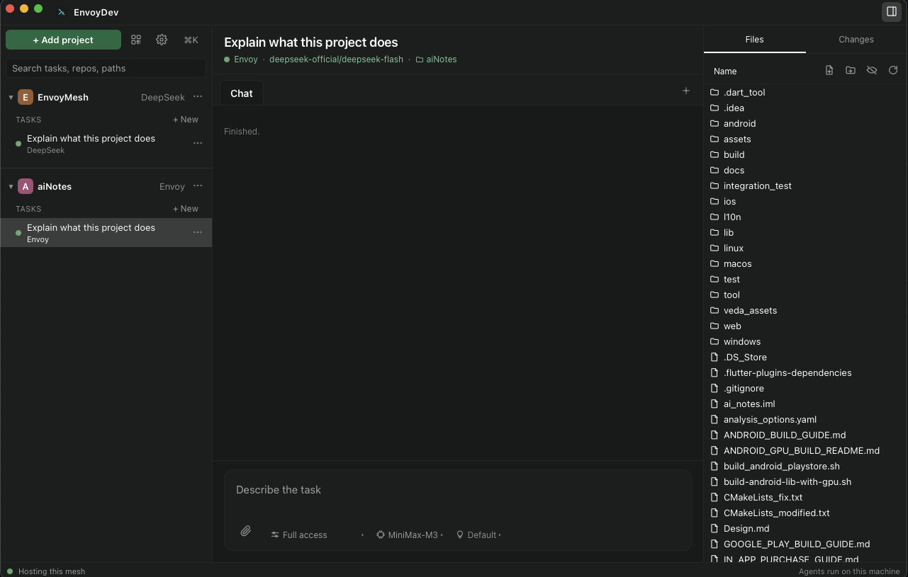
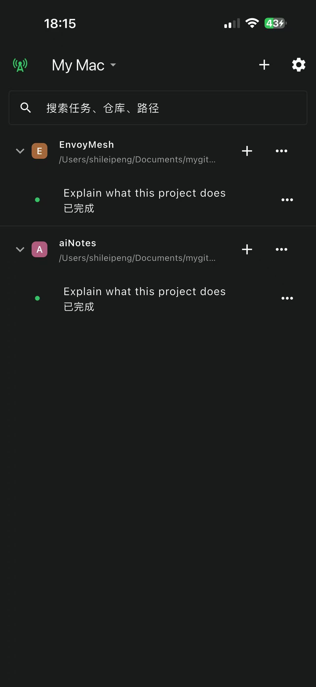
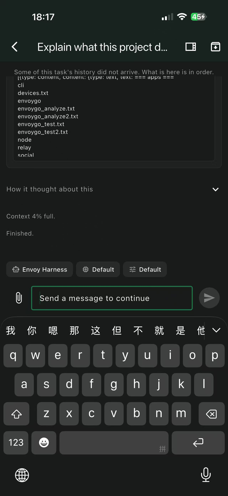
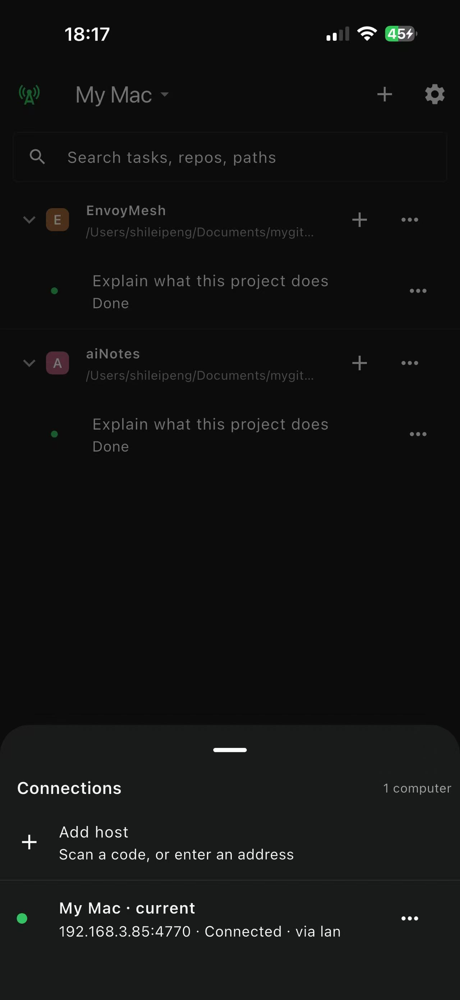
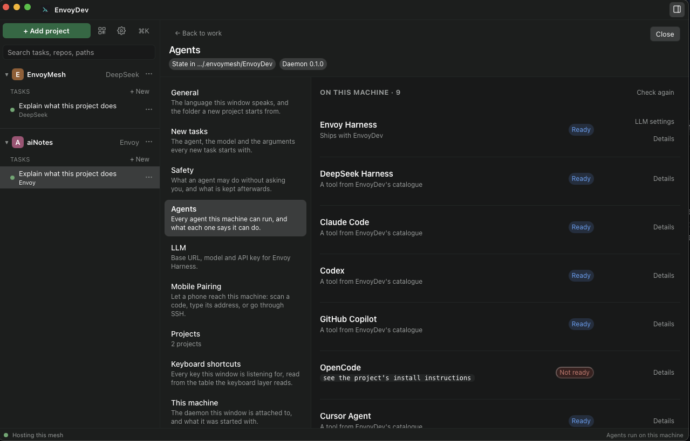

<p align="center">
  
</p>

<h1 align="center">EnvoyDev</h1>

<p align="center"><strong>The control plane for coding agents.</strong></p>

<p align="center">Run Claude Code, Codex, OpenCode, Cursor, and more — on your own machines.<br>
Reach them from a window or a phone. Open source, self-hosted, local-first.</p>

---

## What is EnvoyDev?

EnvoyDev is a desktop app that drives coding agents on the computer where your code lives. It does not try to *be* an agent — it gives Claude Code, Codex, OpenCode, Cursor, DeepSeek's CLI, and others **one unified window**: the same timeline, the same approvals, the same diff review, on every agent.

Your code never leaves your machine. Your model keys stay with the agent that uses them. EnvoyDev never asks for an account.

EnvoyDev is built on **[EnvoyMesh](https://github.com/allenpeng0705/EnvoyMesh)** — part of the apps group that shares the mesh (identity, discovery, relay) and the pairing experience with the rest of the family, while keeping its own project and task state. Product page: [homeclaw.cn/envoy](https://www.homeclaw.cn/envoy).

---

## What can it do?

### Desktop

- **One window, every agent.** Pick the coding agent per task — from the nine EnvoyDev-tested harnesses or from a larger ACP catalogue. Switch models and CLIs without learning a new UI.
- **Projects on the left, tasks in the middle.** A project is the folder you work in. A task is one unit of work in it — with its own branch, agent, and model. Drag the rail and explorer to resize; widths are remembered.
- **See what the agent is doing.** A live transcript with messages, tool calls, file changes, and approval cards.
- **Approve before risky steps.** A permission dock shows scope and risk before each tool runs.
- **Cancel, queue, or steer.** Queue waits for the turn. Steer interrupts it. The transcript records which one happened.
- **Git where the work is.** Branch, fetch, pull, stash, merge — and hand a conflicted merge to an agent when you want help resolving it.
- **Keep the daemon reachable.** App-managed by default; optionally run it as an OS service so the phone can reach a machine with no window open.
- **Resume after a disconnect.** Your work is on your machine — pick it up where you left off.
- **macOS, Windows, and Linux.** All three are first-class. Version `0.1.0` — Settings → About compares this window with the service.

<p align="center">
  
</p>
<p align="center"><em>The project view — one task, one transcript, every agent.</em></p>

### Phone (EnvoyDev Mobile)

- **Pair with any desktop.** Scan a QR code, paste `host:port`, or use an SSH hop — your choice. Same protocol, same security.
- **Continue on the go.** The desktop runs the agent; the phone is a window into the same task. Browse projects, read the live transcript, answer approvals, queue a follow-up, or steer the run.
- **Git from the phone.** Branch, stash, and resolve merge conflicts with the same daemon the desktop uses.
- **Reach your own machines from anywhere.** Home network, office LAN, or a server on the other side of the world — if you can SSH to a host that can see the desktop, the phone can talk to it. No public IP required.
- **Thin client by design.** Your model keys never leave the desktop. The phone never runs an agent.

<p align="center">
  
  &nbsp;
  
  &nbsp;
  
</p>
<p align="center"><em>Projects, a live run, and how the phone reaches the desktop.</em></p>

---

## Coding agents supported

EnvoyDev ships with one unified UI for every first-class coding harness. Install only the CLIs you actually use — EnvoyDev discovers the rest at runtime. Catalogue recipes can be picked for a task and are added automatically when you choose them.

| Tier | Agents |
| --- | --- |
| **Built-in** | Envoy Harness (ACP) |
| **Catalogued** (EnvoyDev-tested) | DeepSeek Harness, Claude Code, Codex, GitHub Copilot, OpenCode, Cursor, OMP, Pi |
| **ACP catalog** (third-party recipes) | 38 more — including Gemini, Grok, Kiro, Kimi, Qwen Code, CodeWhale, MiniMax Code, TraeCLI, Qoder, Cline, Hermes, Goose, Junie, Nova, Poolside, Kilo, Stakpak, and others — probed at runtime, install only what you use |

Your model credentials live with the agent that uses them — EnvoyDev never proxies them, never asks for an account.

<p align="center">
  
</p>
<p align="center"><em>The agents settings page lists every catalogued harness with what this machine can do with each.</em></p>

---

## Code from anywhere — EnvoyDev Mobile

The **EnvoyDev Mobile** app is the phone-side companion to your desktop. It pairs with the desktop over a secure WebSocket and runs on iOS and Android (Flutter). Bundle ID on both platforms: `com.envoymesh.envoydev`.

<p align="center">
  
</p>

### Three ways to pair your phone

- **📷 Scan a QR code** — the fastest path. Open the desktop (Settings → Mobile Pairing, or the rail), show the QR, point the phone. Done.
- **🔌 Paste `host:port`** — type something like `devbox.local:4770` and paste a token. Direct TCP for when you're on the same network or VPN.
- **🔐 Use an SSH hop** — point the phone at any SSH-reachable box that can see the desktop. The tunnel terminates on the daemon's loopback, no public IP needed.

### What you can do from the phone

- See your projects and tasks; start a new task with agent / model / mode
- Read the live transcript
- Answer approval cards
- Queue a follow-up or steer the run
- Stop a run
- Branch, stash, and resolve git conflicts (with an agent when you want)

The phone is a **thin client** — it never runs an agent, never holds a provider key. Your desktop does the work; the phone is the window. Pairing tokens live in the platform secure store; Settings → This machine on the desktop lists the codes this machine has issued.

Store listing copy and icons for App Store / Play live under `apps/mobile/store-release/`.

---

## Built on EnvoyMesh

EnvoyDev is a member of the **[EnvoyMesh](https://github.com/allenpeng0705/EnvoyMesh)** apps group. It shares:

- The same identity (Ed25519 keys, cryptographic pairing)
- The same discovery (LAN → public → P2P → bootstrap → relay, in that order)
- The same mesh and pairing UX as the rest of the family

State is per-product: EnvoyDev keeps its project and task tree under `<home>/EnvoyDev/`. EnvoyMesh's mesh, peer list, and identity are shared.

- Source → [github.com/allenpeng0705/EnvoyMesh](https://github.com/allenpeng0705/EnvoyMesh)
- Product / downloads → [www.homeclaw.cn/envoy](https://www.homeclaw.cn/envoy)

---

## Download / build

Current product version: **0.1.0** (desktop window, daemon, and Tauri package; mobile `0.1.0+1` in `apps/mobile/pubspec.yaml`).

```bash
git clone https://github.com/allenpeng0705/EnvoyCoder.git
cd EnvoyCoder
npm install
npm run tauri:dev   # the desktop app (Tauri shell + daemon)
```

Useful gates from the repo root:

```bash
npm run gates       # peers, wiring, docs, typecheck, tests, …
npm run smoke       # real host, real pairing, real agent probes
npm run daemon      # daemon alone (for pairing a phone in another process)
```

The mobile app is Flutter:

```bash
cd apps/mobile
flutter pub get
flutter test
flutter run         # device or emulator; daemon reachable (same machine, LAN, or SSH)
```

---

## Links

- EnvoyMesh (source) → [github.com/allenpeng0705/EnvoyMesh](https://github.com/allenpeng0705/EnvoyMesh)
- EnvoyMesh (product) → [www.homeclaw.cn/envoy](https://www.homeclaw.cn/envoy)
- envoy-harness (the built-in agent runtime) → [github.com/allenpeng0705/envoy-harness](https://github.com/allenpeng0705/envoy-harness)
- Design notes → [`docs/envoydev-design.md`](docs/envoydev-design.md)
- Roadmap → [`docs/roadmap.md`](docs/roadmap.md)
- Issues → [github.com/allenpeng0705/EnvoyCoder/issues](https://github.com/allenpeng0705/EnvoyCoder/issues)
