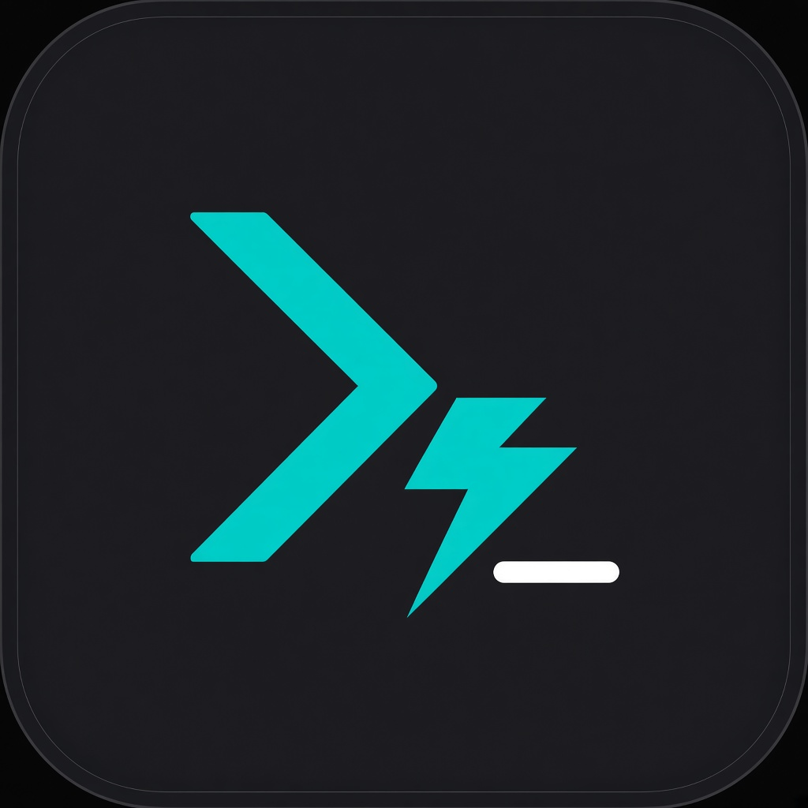

<p align="center">
  
</p>

<h1 align="center">EnvoyDev</h1>

<p align="center"><strong>The control plane for coding agents.</strong></p>

<p align="center">Run Claude Code, Codex, OpenCode, Cursor, Pi, and more — on your own machines.<br>
Reach them from a window or a phone. Open source, self-hosted, local-first.</p>

---

## What is EnvoyDev?

EnvoyDev is a desktop app that drives coding agents on the computer where your code lives. It does not try to *be* an agent — it gives Claude Code, Codex, OpenCode, Cursor, Pi, DeepSeek's CLI, and others **one unified window**: the same timeline, the same approvals, the same diff review, on every agent.

Your code never leaves your machine. Your model keys stay with the agent that uses them. EnvoyDev never asks for an account.

EnvoyDev is part of the **[EnvoyMesh](https://github.com/allenpeng0705/EnvoyMesh)** apps group — it shares the mesh (identity, discovery, relay) and the pairing experience with the rest of the family, and keeps its own project and task state.

---

## What can it do?

- **One window, every agent.** Pick the coding agent per task. Switch models and CLIs without learning a new UI.
- **Projects on the left, tasks in the middle.** A project is the folder you work in. A task is one unit of work in it — with its own branch, agent, and model.
- **See what the agent is doing.** A live transcript with messages, tool calls, file changes, and approval cards.
- **Approve before risky steps.** A permission dock shows scope and risk before each tool runs.
- **Cancel, queue, or steer.** Queue waits for the turn. Steer interrupts it. The transcript records which one happened.
- **Resume after a disconnect.** Your work is on your machine — pick it up where you left off.
- **macOS, Windows, and Linux.** All three are first-class.

---

## Coding agents supported

EnvoyDev ships with one unified UI for every first-class coding harness. Install only the CLIs you actually use — EnvoyDev discovers the rest at runtime.

| Tier | Agents |
| --- | --- |
| **Built-in** | Envoy Harness (ACP), Pi |
| **Tier B catalog** | Claude Code, Codex, OpenCode, Cursor, CodeWhale, DeepSeek Harness, MiniMax Code, Grok, Gemini, TraeCLI, Qoder, Copilot |

Your model credentials live with the agent that uses them — EnvoyDev never proxies them, never asks for an account.

---

## Code from anywhere — EnvoyDev Mobile

The **EnvoyDev Mobile** app is the phone-side companion to your desktop. It pairs with the desktop over a secure WebSocket and runs on iOS and Android (Flutter).

<p align="center">
  
</p>

### Three ways to pair your phone

- **📷 Scan a QR code** — the fastest path. Open the desktop, show the QR, point the phone. Done.
- **🔌 Paste `host:port`** — type something like `devbox.local:4770` and paste a token. Direct TCP for when you're on the same network or VPN.
- **🔐 Use an SSH hop** — point the phone at any SSH-reachable box that can see the desktop. The tunnel terminates on the daemon's loopback, no public IP needed.

### What you can do from the phone

- See your projects and tasks
- Read the live transcript
- Answer approval cards
- Queue a follow-up or steer the run
- Stop a run

The phone is a **thin client** — it never runs an agent, never holds a provider key. Your desktop does the work; the phone is the window.

---

## Built on EnvoyMesh

EnvoyDev is a member of the **EnvoyMesh apps group**. It shares:

- The same identity (Ed25519 keys, cryptographic pairing)
- The same discovery (LAN → public → P2P → bootstrap → relay, in that order)
- The same mesh and pairing UX as the rest of the family

State is per-product: EnvoyDev keeps its project and task tree under `<home>/EnvoyDev/`. EnvoyMesh's mesh, peer list, and identity are shared.

Learn more about the mesh → [github.com/allenpeng0705/EnvoyMesh](https://github.com/allenpeng0705/EnvoyMesh).

---

## Download

For most people: grab the installer from the [EnvoyMesh site](https://github.com/allenpeng0705/EnvoyMesh) when 0.5.0 artifacts are out, or build from source below.

```bash
git clone https://github.com/allenpeng0705/EnvoyCoder.git
cd EnvoyCoder
npm install
npm run tauri:dev   # the desktop app (Tauri shell)
```

The mobile app is Flutter:

```bash
cd apps/mobile
flutter pub get
flutter test
```

---

## Links

- EnvoyMesh (the mesh) → [github.com/allenpeng0705/EnvoyMesh](https://github.com/allenpeng0705/EnvoyMesh)
- envoy-harness (the built-in agent runtime) → [github.com/allenpeng0705/envoy-harness](https://github.com/allenpeng0705/envoy-harness)
- Issues → [github.com/allenpeng0705/EnvoyCoder/issues](https://github.com/allenpeng0705/EnvoyCoder/issues)