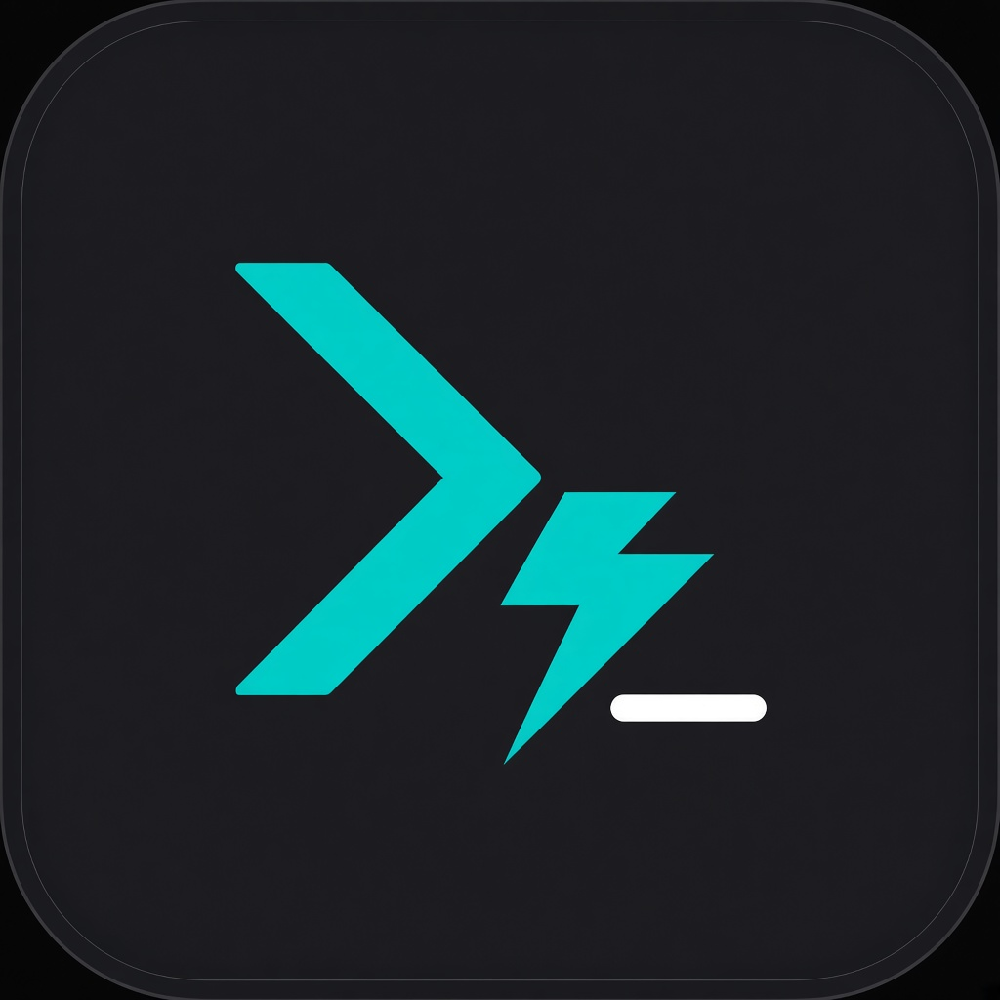
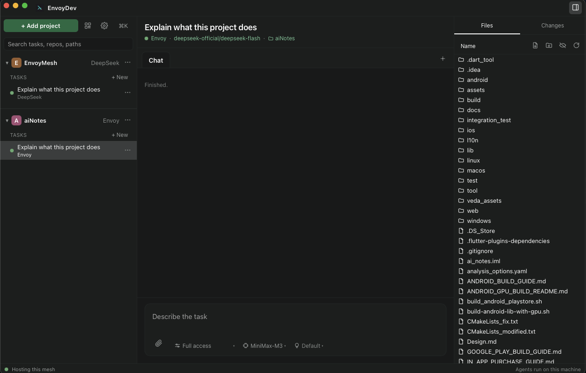
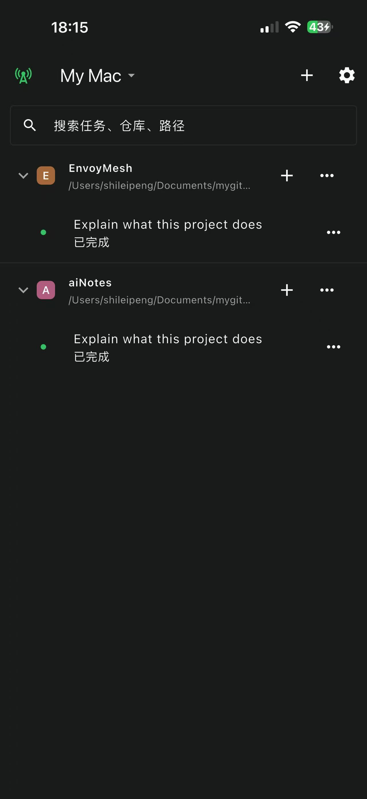
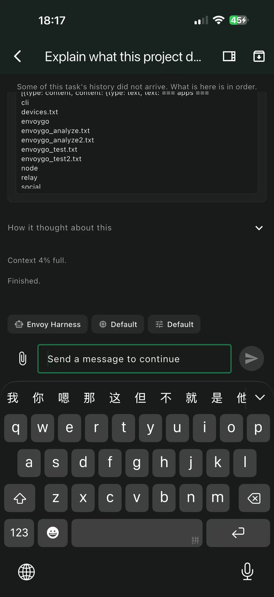
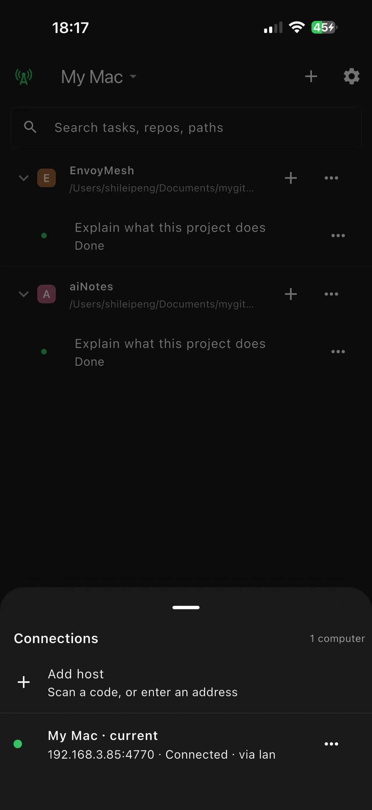
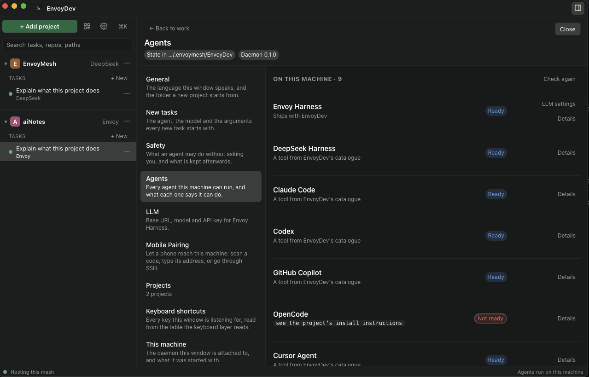

<p align="center">
  
</p>

<h1 align="center">EnvoyDev</h1>

<p align="center"><strong>The control plane for coding agents.</strong></p>

<p align="center">Run Claude Code, Codex, OpenCode, Cursor, and more — on your own machines.<br>
Reach them from a window or a phone. Open source, self-hosted, local-first.</p>

---

## What is EnvoyDev?

EnvoyDev is a desktop app that drives coding agents on the computer where your code lives. It does not try to *be* an agent — it gives Claude Code, Codex, OpenCode, Cursor, DeepSeek's CLI, and others **one unified window**: the same timeline, the same approvals, the same diff review, on every agent.

Your code never leaves your machine. Your model keys stay with the agent that uses them. EnvoyDev never asks for an account.

EnvoyDev is built on **[EnvoyMesh](https://github.com/allenpeng0705/EnvoyMesh)** — part of the apps group that shares the mesh (identity, discovery, relay) and the pairing experience with the rest of the family, while keeping its own project and task state. Product page: [www.envoymesh.cn](https://www.envoymesh.cn).

---

## What can it do?

### Desktop

- **One window, every agent.** Pick the coding agent per task — from the nine EnvoyDev-tested harnesses or from a larger ACP catalogue. Switch models and CLIs without learning a new UI.
- **Projects on the left, tasks in the middle.** A project is the folder you work in. A task is one unit of work in it — with its own branch, agent, and model. Drag the rail and explorer to resize; widths are remembered.
- **See what the agent is doing.** A live transcript with messages, tool calls, file changes, and approval cards.
- **Approve before risky steps.** A permission dock shows scope and risk before each tool runs.
- **Cancel, queue, or steer.** Queue waits for the turn. Steer interrupts it. The transcript records which one happened.
- **Git where the work is.** Branch, fetch, pull, stash, merge — and hand a conflicted merge to an agent when you want help resolving it.
- **Keep the daemon reachable.** App-managed by default; optionally run it as an OS service so the phone can reach a machine with no window open.
- **Pair once, stay paired.** Codes and links last until you revoke them under This machine (or Forget on the thin client) — no calendar expiry after a restart.
- **Reach another home from this laptop.** Settings → **Paired homes** joins a server or office machine as a thin client — see [Paired homes](#paired-homes--another-machine-from-this-laptop) below.
- **Team jobs across machines.** Host a team, invite another EnvoyDev, and run collaborative steps on the same Git project — see [Team jobs](#team-jobs--work-across-machines) below.
- **Resume after a disconnect.** Your work is on your machine — pick it up where you left off.
- **macOS, Windows, and Linux.** All three are first-class. Desktop version is the one-line `VERSION` file at the repo root (`npm run version:desktop`) — Settings → About compares this window with the service.

<p align="center">
  
</p>
<p align="center"><em>The project view — one task, one transcript, every agent.</em></p>

### Paired homes — another machine from this laptop

A **paired home** is a different EnvoyDev (a server, an office desktop, a box at home) that this laptop reaches as a **thin client**. Agents and provider keys stay on that home; you start runs, watch them, and answer approvals from here. Everyday work on *this* machine is unchanged — Paired homes are for when the code and the daemon live elsewhere.

#### How to join

1. **Mint a code on the home** — Settings → **Pair devices**, or copy a pairing link. Pairings stay until you revoke them.
2. **Or share from a phone already paired with that home** — on the phone, open the host → **Share connection**. It copies only the method that phone used (link, `host:port` + token, or SSH). Use this when you are away and cannot open Settings on the home to mint a new code.
3. **On this laptop** — Settings → **Paired homes**. Name the home, then paste on the **Pairing link** tab (link or shared text), or fill **Host:port** / **SSH**. **Join**.
4. **Switch homes** from the rail under Paired EnvoyDev. The window reconnects after restart until you **Forget** (credentials on this laptop only) or revoke on the home.

**SSH note:** if the daemon address is loopback on the far side (`127.0.0.1:…`), EnvoyDev opens a local-forward through the SSH hop before connecting — it does not dial loopback on the laptop.

**If the home stays Offline** after Join:

1. Desktop Paired homes walk the **same family ladder as the phone** — LAN → public → P2P → bootstrap → **relay** last — from the pairing link's addresses and mesh fields (`homeNodePeerId` / `bootstrapPeers`). Off-LAN, the community relay rung is tried after direct addresses fail (not a product-specific relay).
2. On the **home**, prefer a **LAN or public IP** in the link, not only `127.0.0.1`. Mint with Host:port using the machine's LAN IP if needed.
3. **LAN:** same Wi-Fi/subnet, and allow EnvoyDev inbound on the home firewall (daemon port, default **4770**).
4. **WAN:** the relay rung covers many cases; you can also use **SSH** (Settings → Paired homes → SSH), or put both machines on Tailscale/VPN. Pure libp2p multiaddr dials still need a window transport (phone has one; desktop skips those rungs and continues to relay).
5. On the laptop, **Retry** the home from the rail after network changes, or re-join with **Host:port** + token when you are on that LAN.

**Packaged-app CSP:** Pair homes dials LAN and community-relay WebSockets from the window, so `connect-src` allows `ws:` / `wss:` (not only `127.0.0.1`). That is intentional for reachability; a compromised webview could open arbitrary WebSockets. A future shell-side proxy could tighten CSP again.

Paired homes are a thin-client join. For collaborative steps on the same Git project across members, use [Team jobs](#team-jobs--work-across-machines).

---

### Team jobs — work across machines

A **Team job** is collaborative work on a **Git project**: one machine hosts the team (origin), others join with an invite, and each step runs on a member’s local clone. Everyday **Tasks** stay single-agent on one machine; Team jobs are a separate entry under the project.

Design and wire details: [`docs/envoydev-collaboration.md`](docs/envoydev-collaboration.md).

#### How to use it

1. **Prepare Git** — On every machine that will run a step, open the same project as a Git repo with at least one remote (`origin` is fine). Team jobs share work through Git, not the mesh.
2. **Host a team** — On the origin desktop: Settings → **Teams** → **Create team**, or create one while starting a Team job. Copy the invite (shown once).
3. **Join** — On another EnvoyDev: Settings → **Teams** → **Join team**, paste the invite, pick roles this machine offers.
4. **Start a Team job** — On the origin, open a project → **Team job**. Choose (or create) a team, set title and goal, **Create draft**. Use step templates / Suggest in the Job pane, then **Start** when peers are online with the roles you need.
5. **Phone (optional)** — A paired phone can watch the job and answer approvals; team admin and Start stay on the origin desktop.

If you **Cancel** a Team job sheet after creating a new team and before **Create draft**, that unused solo team is removed so Settings does not fill with leftovers.

#### Try two peers on one computer

One EnvoyDev install is one identity — a second window attaches to the same daemon. For a real join, run **two homes**:

```bash
# Terminal A — origin
ENVOYMESH_HOME=/tmp/envoy-origin npm run tauri:dev

# Terminal B — peer
ENVOYMESH_HOME=/tmp/envoy-peer npm run tauri:dev
```

Use the same Git project path (or two clones of the same remote) on both. Automated proof of the invite → join → offer path:

```bash
npx vitest run apps/desktop/test/m5-two-daemon.test.ts
```

---

### Phone (EnvoyDev Mobile)

- **Pair with any desktop.** Scan a QR code, paste `host:port`, or use an SSH hop — your choice. Same protocol, same security. Pairings last until you Forget or revoke — no need to re-pair after a restart.
- **Continue on the go.** The desktop runs the agent; the phone is a window into the same task. Browse projects, read the live transcript, answer approvals, queue a follow-up, or steer the run.
- **Share a home with a laptop.** **Share connection** copies the method this phone used so a travel laptop can join under Settings → Paired homes without minting a new code on the home.
- **Git from the phone.** Branch, stash, and resolve merge conflicts with the same daemon the desktop uses.
- **Reach your own machines from anywhere.** Home network, office LAN, or a server on the other side of the world — if you can SSH to a host that can see the desktop, the phone can talk to it. No public IP required.
- **Thin client by design.** Your model keys never leave the desktop. The phone never runs an agent.

<p align="center">
  
  &nbsp;
  
  &nbsp;
  
</p>
<p align="center"><em>Projects, a live run, and how the phone reaches the desktop.</em></p>

---

## Coding agents supported

EnvoyDev ships with one unified UI for every first-class coding harness. Install only the CLIs you actually use — EnvoyDev discovers the rest at runtime. Catalogue recipes can be picked for a task and are added automatically when you choose them.

| Tier | Agents |
| --- | --- |
| **Built-in** | Envoy Harness (ACP) |
| **Catalogued** (EnvoyDev-tested) | DeepSeek Harness, Claude Code, Codex, GitHub Copilot, OpenCode, Cursor, OMP, Pi |
| **ACP catalog** (third-party recipes) | 38 more — including Gemini, Grok, Kiro, Kimi, Qwen Code, CodeWhale, MiniMax Code, TraeCLI, Qoder, Cline, Hermes, Goose, Junie, Nova, Poolside, Kilo, Stakpak, and others — probed at runtime, install only what you use |

Your model credentials live with the agent that uses them — EnvoyDev never proxies them, never asks for an account.

<p align="center">
  
</p>
<p align="center"><em>The agents settings page lists every catalogued harness with what this machine can do with each.</em></p>

---

## Code from anywhere — EnvoyDev Mobile

The **EnvoyDev Mobile** app is the phone-side companion to your desktop. It pairs with the desktop over a secure WebSocket and runs on iOS and Android (Flutter). Bundle ID on both platforms: `com.envoymesh.envoydev`.

<p align="center">
  
</p>

### Three ways to pair your phone

- **📷 Scan a QR code** — the fastest path. Open the desktop (Settings → Pair devices, or the rail), show the QR, point the phone. Done.
- **🔌 Paste `host:port`** — type something like `devbox.local:4770` and paste a token. Direct TCP for when you're on the same network or VPN.
- **🔐 Use an SSH hop** — point the phone at any SSH-reachable box that can see the desktop. The tunnel terminates on the daemon's loopback, no public IP needed.

Pairings stay until you Forget the host on the phone or revoke the device under Settings → This machine on the desktop.

### What you can do from the phone

- See your projects and tasks; start a new task with agent / model / mode
- Read the live transcript
- Answer approval cards
- Watch a **Team job** and answer its approvals (create team / Start stay on the desktop)
- **Share connection** so a laptop can join that home under Paired homes (only the method this phone used)
- Queue a follow-up or steer the run
- Stop a run
- Branch, stash, and resolve git conflicts (with an agent when you want)

The phone is a **thin client** — it never runs an agent, never holds a provider key. Your desktop does the work; the phone is the window. Pairing tokens live in the platform secure store; Settings → This machine on the desktop lists the codes this machine has issued.

Store listing copy and icons for App Store / Play live under `apps/mobile/store-release/`.

---

## Built on EnvoyMesh

EnvoyDev is a member of the **[EnvoyMesh](https://github.com/allenpeng0705/EnvoyMesh)** apps group. It shares:

- The same identity (Ed25519 keys, cryptographic pairing)
- The same discovery (LAN → public → P2P → bootstrap → relay, in that order)
- The same mesh and pairing UX as the rest of the family

State is per-product: EnvoyDev keeps its project and task tree under `<home>/EnvoyDev/`. EnvoyMesh's mesh, peer list, and identity are shared.

- Source → [github.com/allenpeng0705/EnvoyMesh](https://github.com/allenpeng0705/EnvoyMesh)
- Product / downloads → [www.envoymesh.cn](https://www.envoymesh.cn)

---

## Download / build

Current desktop product version: see the one-line **`VERSION`** file at the repo root (bump with `npm run version:desktop -- 0.2.0`). Mobile is separate: `0.1.0+1` in `apps/mobile/pubspec.yaml`.

```bash
git clone https://github.com/allenpeng0705/EnvoyCoder.git
cd EnvoyCoder
npm install
npm run tauri:dev   # the desktop app (Tauri shell + daemon)
```

To bump the desktop version before packaging:

```bash
npm run version:desktop -- 0.2.0   # writes VERSION and syncs package.json / daemon / Tauri / Cargo
npm run version:desktop:check      # gates also run this
```

macOS release DMG (`npm run tauri:build:mac` / `bash scripts/build-dmg.sh`): copy `scripts/sign-macos-release.env.example` → `scripts/sign-macos-release.env` and fill the four Apple Developer ID fields (same values as EnvoyMesh work). Without that file the DMG is unsigned; with it, nested resources and `EnvoyDev.app` are signed and Tauri notarizes when Apple accepts the ticket. Installers land in `release/` (override with `OUT_DIR=…`). Operator notes live in the EnvoyMesh sibling as `docs/macos-mirror-signing.md`.

**Packaging index** (Windows EXE, Linux, harness dir, mobile pointers): [`scripts/README.md`](scripts/README.md).

Useful gates from the repo root:

```bash
npm run gates       # peers, wiring, docs, typecheck, tests, …
npm run smoke       # real host, real pairing, real agent probes
npm run daemon      # daemon alone (for pairing a phone in another process)
```

The mobile app is Flutter:

```bash
cd apps/mobile
flutter pub get
flutter test
flutter run         # device or emulator; daemon reachable (same machine, LAN, or SSH)
```

---

## Links

- EnvoyMesh (source) → [github.com/allenpeng0705/EnvoyMesh](https://github.com/allenpeng0705/EnvoyMesh)
- EnvoyMesh (product) → [www.envoymesh.cn](https://www.envoymesh.cn)
- envoy-harness (the built-in agent runtime) → [github.com/allenpeng0705/envoy-harness](https://github.com/allenpeng0705/envoy-harness)
- Collaborative Team jobs → [`docs/envoydev-collaboration.md`](docs/envoydev-collaboration.md)
